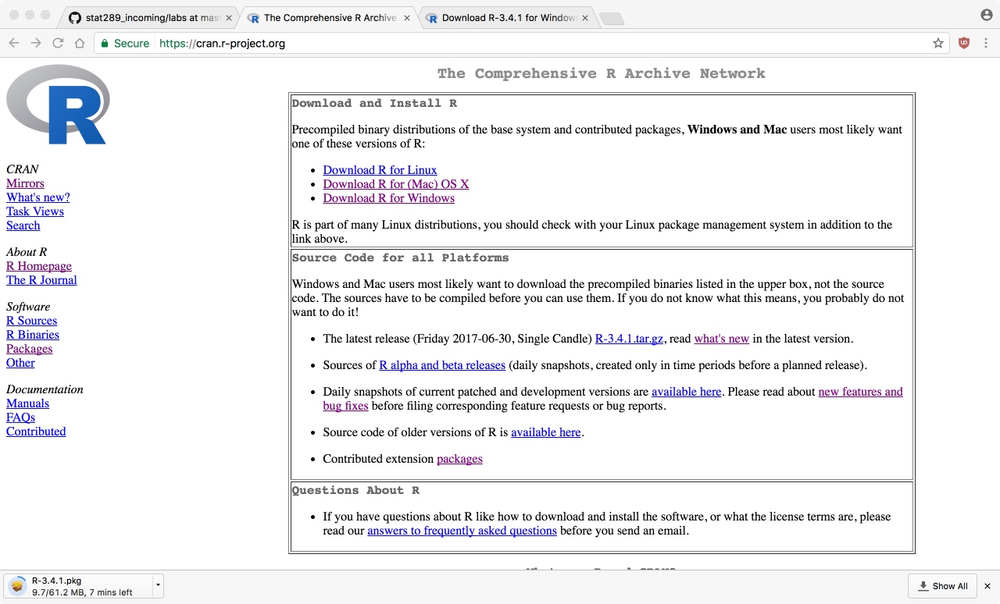
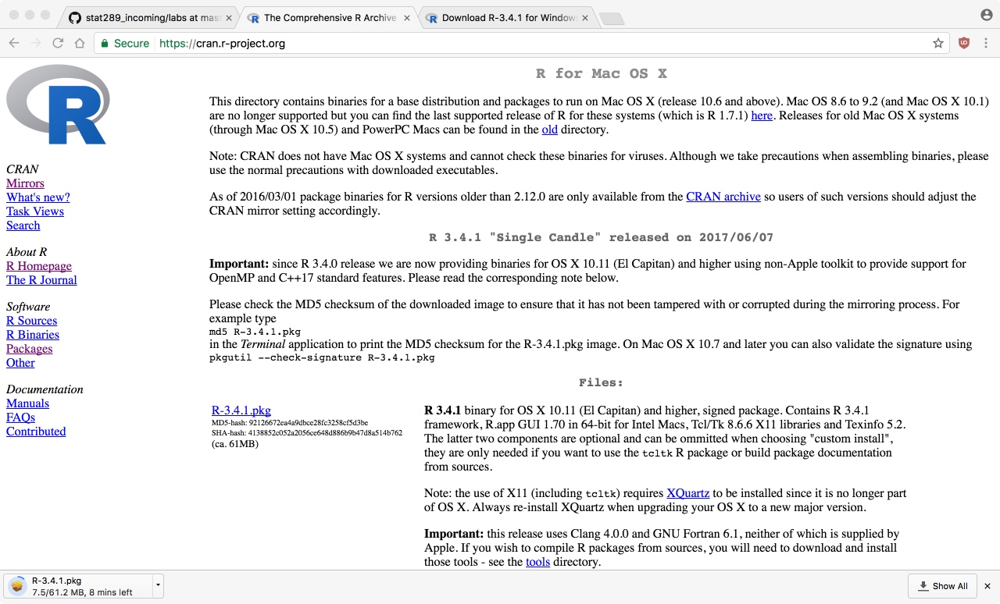
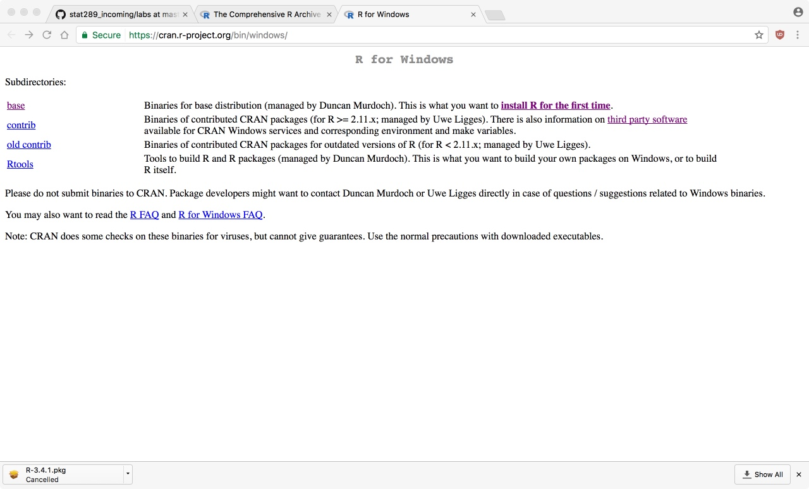
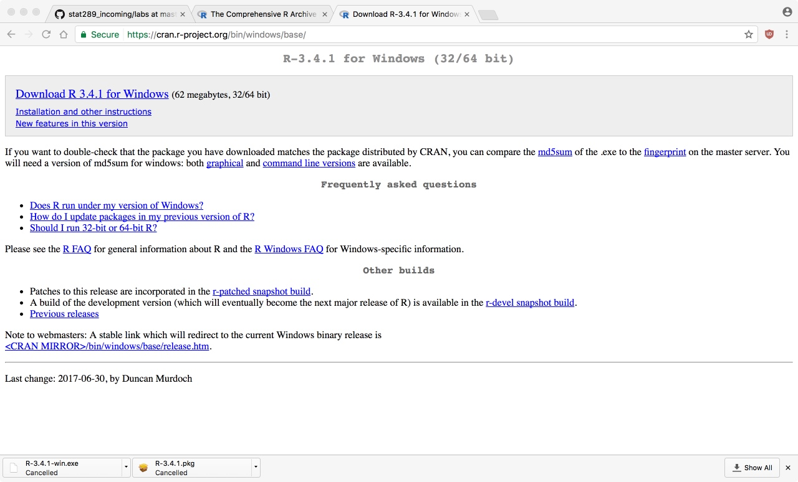

## Installing R

### What is R?

We will use the **R** programming environment for our lab next week. It is freely
available for all major operating systems and is pre-installed on many campus
computers. Today, we will walk through steps for setting it up on your own machine.

### Download R (Step 1)

We need to download the R programming language. To do
this go to [https://cran.r-project.org/](https://cran.r-project.org/)
and select your platform:



### Download R (Mac Step 2)

For macOS, just download R-3.4.1 (or whatever is the most recent):



### Download R (Windows Step 2)

For Windows, first select **base**



### Download R (Windows Step 3)

And then *Download R 3.4.1*



### Install R 

One you have the .pkg (macOS) or .exe (Windows) file,
install this on your computer according to the default
settings. 

### Packages

We have just installed the base version of R. For the work next
week, we'll need two add on components to the language. These
are known as R packages. To install the first, open R on your machine
and type or copy the following line of code:

```{r}
install.packages("stringi")
```

You may have a window pop up asking where you would like to download
the files from. Select either the "Cloud" option or pick a site reasonably
close to us. You may also have R ask you whether you want to compile from
source packages that require it. Try to answer "no" and if that fails then
answer yes.

Install the second package with this:

```{r}
install.packages("topicmodels")
```

You may see a lot of output spit out in the terminal as you do this. That
is normal! Finally, you can check to see that this worked by running the
following:

```{r}
library(stringi)
library(topicmodels)
```

If these running without any errors, you are all set! If they produce a
"warning" (usually saying that the package was built under a certain 
version of R), that is also fine too and should not be an issue. Unless
it actually says "Error" there should be no problem.
